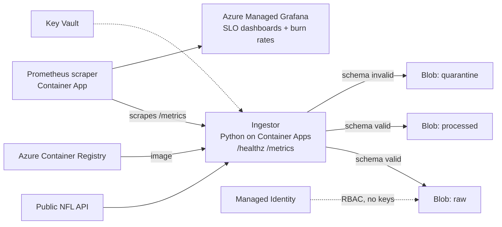

# NFL Data Reliability Platform (Azure)

Treats a public NFL sports API as a production data source and wraps ingestion with SRE-style observability, reliability signals, and Infrastructure as Code: SLIs, SLOs, burn rate analysis, and runbooks, all provisioned with modular Terraform.

## Architecture



The ingestor pulls NFL payloads on a schedule, validates them against a schema, and routes blobs to raw, processed, or quarantine paths. A Prometheus scraper container app collects custom metrics from the ingestor, surfaced in Azure Managed Grafana with PromQL burn rate analysis against defined SLO targets.

## Reliability Signals

| SLI metric | What it tracks |
|---|---|
| `ingestion_runs_total{result}` | Ingestion success rate |
| `schema_validity_total{valid}` | Share of payloads passing schema validation |
| `data_freshness_seconds` | Age of the most recent successful ingest |
| `ingestion_last_success_timestamp_seconds` | Last-success timestamp for alerting |

PromQL references for SLOs and burn rates live in [`ops/slo`](ops/slo), and the incident runbook (ingestion failure, schema drift, freshness degradation) in [`ops/runbooks`](ops/runbooks).

## Core Components

- **Azure Container Apps**: ingestor service and Prometheus scraper
- **Azure Blob Storage**: raw / processed / quarantine containers, RBAC-scoped to the ingestor's managed identity (no access keys)
- **Azure Container Registry**: deployment images
- **Azure Key Vault**: secrets for future integrations
- **Azure Managed Grafana**: dashboards over Prometheus metrics

## Repository Structure

```
infra/bootstrap/            Remote state backend resources
infra/environments/dev/     Dev environment root wiring all modules
infra/modules/              acr, blob_storage, container_app_ingestor,
                            container_app_prometheus, container_apps_env,
                            identity_uami, key_vault, managed_grafana, ...
services/ingestor/          Python ingestion service, schema, Dockerfile
ops/slo/                    SLO + burn rate PromQL references
ops/runbooks/               Incident response runbooks
```

## Deploy and Destroy

```bash
cd infra/environments/dev
terraform init && terraform apply   # deploy
terraform destroy                   # teardown (then infra/bootstrap to remove state backend)
```

Designed to be deployed for testing and destroyed afterward to keep Azure spend near zero.

## Notes

The ingestor image must be built and pushed as `linux/amd64` for Azure Container Apps compatibility when developing on Apple Silicon.
